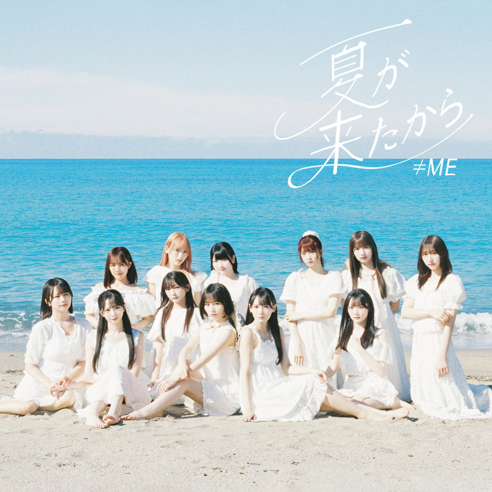

# アイドルの歌詞内容からLLMを使って夏曲判定をする。

## 目次

- [やったこと・背景](##やったこと・背景)
    - [背景](#背景)
    - [やってみたこと](やってみたこと)
    
## やったこと・背景

### 背景

- 社外ハンズオンに出た際に、非構造化データを構造化データにする時はJSON形式で出してみるんだよと聞いてやってみた

### やってみたこと

- ≠MEの「夏が来たから」のジャケ写からアーティスト名と曲名を抽出し、構造化データにする。

## 実際にやってみた

以下のコードのように、画像からアーティスト名と曲名を抽出してきて、JSON形式でかえしてもらう。

<pre><code>
# 画像ファイルを読み込んで base64 に変換
def encode_image(image_path):
    with open(image_path, "rb") as image_file:
        return base64.b64encode(image_file.read()).decode('utf-8')

# 画像のパス
image_path = "images/test2.jpg"  # 例: 曲名とアーティスト名が写っている画像

# base64 にエンコード
base64_image = encode_image(image_path)

# LLMへ問い合わせ
response = openai.chat.completions.create(
    model="gpt-4o",
    messages=[
        {
            "role": "user",
            "content": [
                {
                    "type": "text",
                    "text": (
                        "この画像に写っているアーティスト名と曲名を日本語で抽出し、"
                        "次のようなJSON形式で出力してください：\n"
                        "{\n  \"artist\": \"アーティスト名\",\n  \"title\": \"曲名\"\n}"
                    )
                },
                {
                    "type": "image_url",
                    "image_url": {
                        "url": f"data:image/jpeg;base64,{base64_image}"
                    }
                }
            ]
        }
    ],
    max_tokens=300
)
</code></pre>

## 結果

こんな感じで帰ってきた。

<pre><code>
{
  "artist": "≠ME",
  "title": "夏が来たから"
}
</code></pre>

