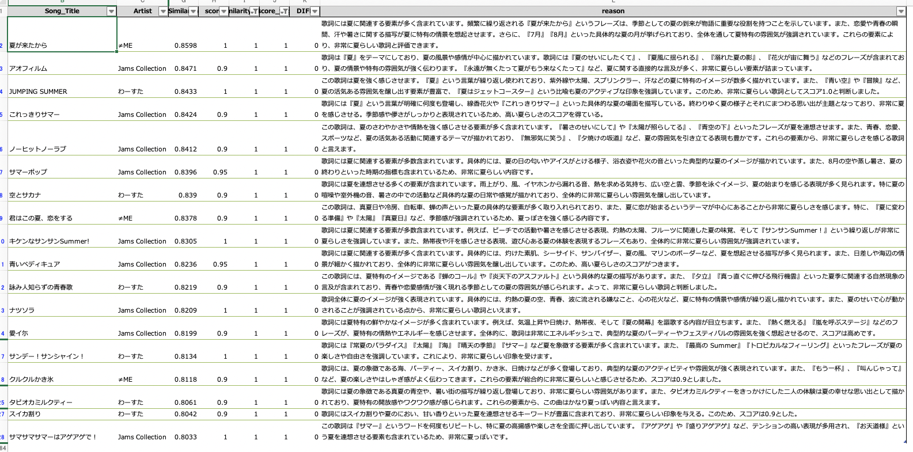
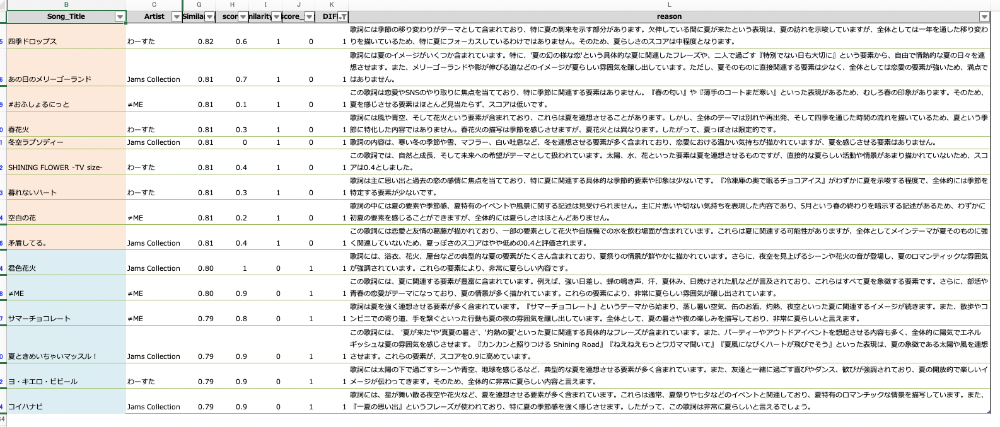

# アイドルの歌詞内容からLLMを使って夏曲判定をする。

## 目次

- [やったこと・背景](##やったこと・背景)
    - [背景](#背景)
    - [やってみたこと](やってみたこと)
- [分析STEP](#分析STEP)
    - [3アイドルの歌詞をスクレイピングする。](#3アイドルの歌詞をスクレイピングする。)
    - [Embeddingsモデルで歌詞をベクトル化し、夏というワードのコサイン類似度を見る。](#Embeddingsモデルで歌詞をベクトル化し、夏というワードのコサイン類似度を見る。)
    - [LLM as a judge](#llm-as-a-judge)
- [結果](#結果)
    
## やったこと・背景

### 背景

- 社外ハンズオンに出た際に、文章をベクトル化(Embedding)してコサイン類似度でポジネガやラベル付与を判別するというのが自分の引き出しになかった。
- さらに、LLM as a judgeで上記判別の確認したり理由を書いてもらうということの引き出しに現状の自分になかった。
- 上記二つやってみておいて所感を体得しておく。

### やってみたこと

アイドルの歌詞から夏曲とカテゴライズできるものを判定してみる。

### やってみての所感

- ベクトル化→コサイン類似度で判別とすることで、コサイン類似度の大きい順に並べて確認するという確認の仕方ができるようになってチェック・確認がすごくしやすい
- ベクトル化→コサイン類似度のアプローチだと複数のニュアンスが入っている場合判別が怪しくなる時があるのかも？なので、LLM as a judgeは下流の過程でやっておくのが良さそう。
    - 例えば、今回だと春夏秋冬すべてが歌の中に入っていても夏判定されてしまうとか...
- LLM as a judgeであてはまり度の理由を書かせることで、各文章が振り分けられた理由まで作成が完了して楽
- LLM as a judgeの結果を出力する際にJSON形式で出力するようにプロンプトを気をつけるだけでその後のハンドリングめっちゃ楽
<pre><code>
# 例
 1. 次のようなJSON形式で出力してください：
    {{
    "score": 数値（0.0〜1.0）, 
    "reason": "夏っぽさに関する説明"
    }}
</code></pre>


## 分析STEP

- 個人的に好きな3アイドル(わーすた、JamsCollection、≠ME)の歌詞をスクレイピングしてくる
- OpenAI APIでEmbeddingsモデルを使って歌詞をベクトル化し、夏というワードのベクトルとのコサイン類似度で夏曲の判定を行う。
- LLM as a judgeで夏曲かそうじゃないか？を判定する。

### 3アイドルの歌詞をスクレイピングする。
このコードを見れば、だれでもスクレイピングできる。

[https://qiita.com/q-tyl/items/0aee46e8ec68497e1700](https://qiita.com/q-tyl/items/0aee46e8ec68497e1700)

### Embeddingsモデルで歌詞をベクトル化し、夏というワードのコサイン類似度を見る。

今回はOpenAI APIのEmbeddingsモデルを使って、ベクトル化→コサイン類似度を計測してみた。

参照：[https://github.com/gh640/openai-models-ja](https://github.com/gh640/openai-models-ja)

<pre><code>
#%%
# ①「夏」というワードをベクトル化 ------------
TARGET_WORD = "夏"
res_llm_summer = openai.embeddings.create(
                                model = 'text-embedding-ada-002'
                                , input = TARGET_WORD
                                )
vec_summer = [d.embedding for d in res_llm_summer.data][0]

# 
def Embdding_by_openai(Lyric, vec_summer):
    # ②判定したい歌詞をベクトル化
    res_llm_lyric = openai.embeddings.create(
                                    model = 'text-embedding-ada-002'
                                    , input = Lyric
                                    )
    vec_lyric = [d.embedding for d in res_llm_lyric.data][0]

    # コサイン類似度
    similarity = cosine_similarity([vec_lyric], [vec_summer])[0][0]
    return similarity

for i in range(len(datasets)):
    Lyric = datasets.iloc[i]["Lyric"]
    datasets.at[i, "Similarity"] = Embdding_by_openai(Lyric, vec_summer)
res_embedding = datasets.sort_values("Similarity", ascending=False)
</code></pre>

### LLM as a judge

LLM as a judgeでも、歌詞が夏っぽいか？を判定し、先ほどの結果と見比べてみた。

<pre><code>
# 全アイドルLLM as a Judge実行 -----------------------------------
for i in range(len(res_embedding)):
    Lyric = res_embedding.iloc[i]["Lyric"]

    model = "gpt-4o"
    prompt = f"""
    あなたは、歌詞の内容を元に「夏っぽいかどうか」を判定するスペシャリストです。
    次のルールに従って結果を出力してください。

    1. 次のようなJSON形式で出力してください：
    {{
    "score": 数値（0.0〜1.0）, 
    "reason": "夏っぽさに関する説明"
    }}

    2. "score" は夏らしさのスコアを 0〜1 の範囲でNumericに出力してください。
    0 は夏とまったく関係ない、1 は非常に夏らしいことを意味します。

    以下が歌詞です：

    {Lyric}
    """

    response = openai.chat.completions.create(
        model = model,
        messages = [{"role":"user","content":prompt}]
    )
    content = response.choices[0].message.content.strip()
    # コードブロックを外す処理
    if content.startswith("```") and content.endswith("```"):
        content = "\n".join(content.split("\n")[1:-1]).strip()
    result = json.loads(content)
    res_embedding.iloc[i, res_embedding.columns.get_loc("score")] = result["score"]
    res_embedding.iloc[i, res_embedding.columns.get_loc("reason")] = result["reason"]
</code></pre>

[https://qiita.com/t-hashiguchi/items/06222acd1643bc209b44](https://qiita.com/t-hashiguchi/items/06222acd1643bc209b44)


## 結果

### 両方のアプローチで夏曲判定された曲

多分伝わらないけども、めっちゃくちゃ納得感のある結果になっている。



### 片方のアプローチで夏曲判定された曲

- オレンジ：ベクトル化→コサイン類似度のアプローチ
- 青：LLM as a judge

正直、LLM as a judgeの判断の方が納得感ある。<br>
オレンジの方は、曲の一部に夏っぽい要素が少しでもあったら拾ってしまっている感じがある。<br>
なので、分類はベクトル化→コサイン類似度でやってLLM as a judgeで確認するが一番よさそう。




